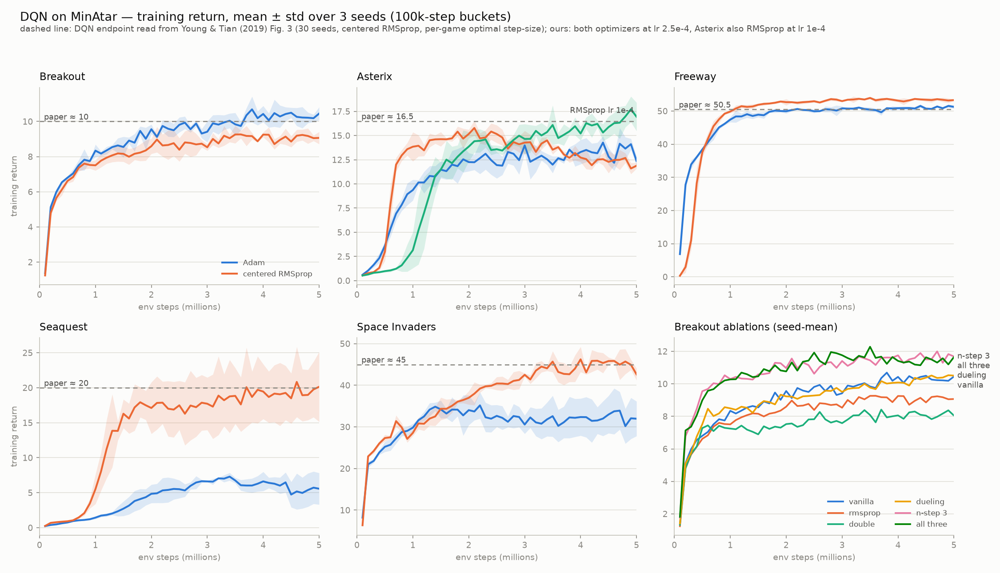
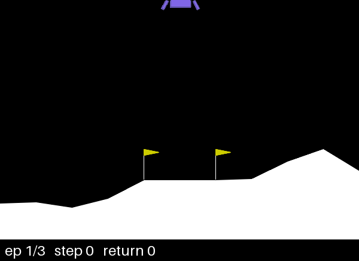
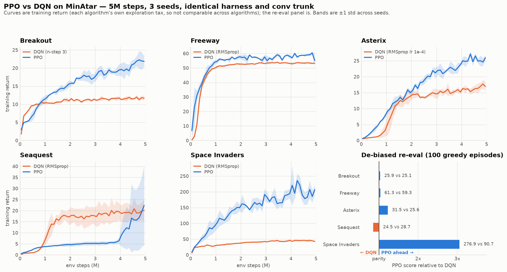
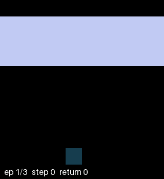
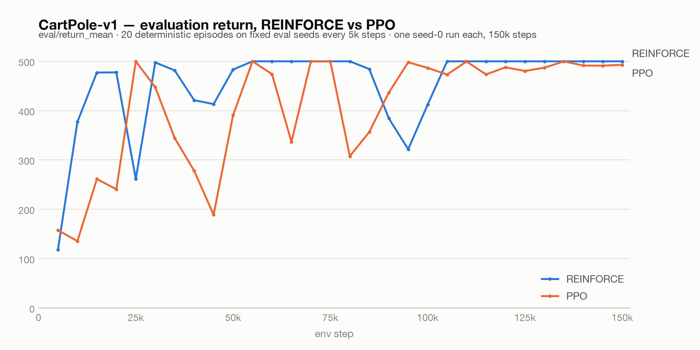
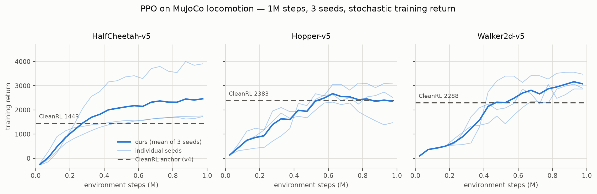
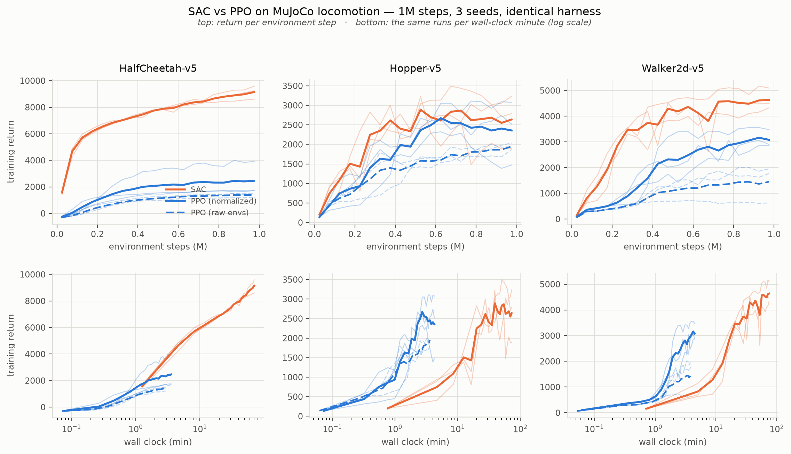
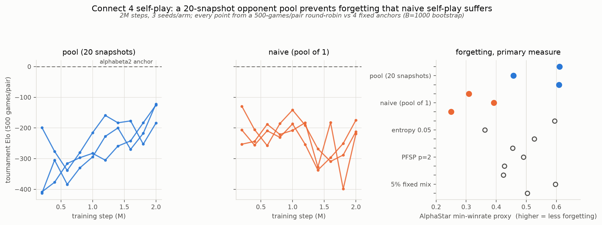

# deep-rl-from-scratch

Deep reinforcement learning algorithms — DQN, PPO, SAC — implemented from scratch in PyTorch and benchmarked apples-to-apples on a shared training harness. No RL libraries.

The project has two parts:

- **Spine:** DQN → PPO → SAC, each a standalone milestone with a headline metric against a published baseline. Vanilla DQN is discrete-only and SAC is continuous-only, so the suite runs on two tracks with PPO as the bridge:
  - **Discrete** (DQN vs PPO): CartPole / LunarLander for sanity checks, then MinAtar.
  - **Continuous** (PPO vs SAC): MuJoCo locomotion (HalfCheetah, Hopper, Walker2d).
- **Capstone:** Pokémon Showdown Gen 1 singles (battle phase only) via poke-env against a local Showdown server, with PPO + self-play. A Connect 4 self-play on-ramp comes first, so the self-play loop, checkpoint pool and Elo harness are built and validated somewhere a run takes minutes and a solver gives ground truth.

## Layout

```
configs/          # one YAML per run: env id, seed, algorithm hyperparameters
rl/
├── agents/       # Agent interface + implementations (random, tabular Q; DQN/PPO/SAC later)
├── networks/     # MLP/CNN encoders (later phases)
├── buffers/      # replay (off-policy) and rollout (on-policy) buffers
├── envs/         # Gymnasium env factory + wrappers; vectorization seam
├── common/       # seeding, config, logger, evaluation, checkpointing
└── train.py      # unified entry point: config -> env + agent -> train/eval loop
scripts/          # run helpers
tests/            # harness sanity tests (must always stay green)
runs/             # run outputs: checkpoints, TensorBoard events (gitignored)
```

Every algorithm plugs into the same entry point, logger, and evaluation protocol:

```
python -m rl.train --config configs/<run>.yaml
```

## Design rules

- **From scratch.** No Stable-Baselines3, RLlib, Tianshou, or CleanRL as dependencies — owning the algorithm implementations is the point.
- **One harness.** Shared seeding, logging, evaluation, and checkpointing, with locked metric names (`rollout/episode_return`, `eval/return_mean`, …) so learning curves compare directly across algorithms.
- **Both action spaces are first-class.** Nothing in shared code assumes discrete actions.
- **Reproducible evaluation:** fixed eval seeds, deterministic policy, N episodes, mean ± std.
- **Minimal dependencies**, pinned. CPU by default — including the capstone's online self-play; a GPU enters only for offline supervised arms if adopted.

## Status

| Phase | Deliverable | Status |
|------:|-------------|--------|
| 0 | Repo + shared harness; random-policy pipeline check on CartPole; tabular Q-learning on FrozenLake | done — Q-learning hits 0.67 success on slippery FrozenLake (random: 0.02, optimal: ~0.74) |
| 1 | DQN (replay buffer, target network, ε-greedy; Double/Dueling/n-step as toggles) | done — reproduces the MinAtar paper's DQN on all 5 games (see Results); solves CartPole/LunarLander at peak |
| 2 | PPO (GAE, clipped objective, entropy bonus, vectorized rollouts) | **done, both tracks** — beats DQN on 3 of 5 MinAtar games; reproduces the reference on MuJoCo locomotion (see Results) |
| 3 | SAC (twin critics, reparameterized actor, auto-tuned entropy temperature) | **done** — beats PPO on all three MuJoCo envs per sample and loses to it per minute; validated against published SAC (see Results) |
| 4 | Connect 4 self-play on-ramp: opponent pool, checkpoint Elo harness | **done** — naive self-play forgets (no proxy overlap vs the pool arm), measured on an exact-oracle instrument stack (see Results) |
| 5 | Capstone: Pokémon Showdown Gen 1 via PPO + self-play | **in progress** — milestone 1 passed; milestone 2 (0.5 vs SimpleHeuristics) not passed, best 0.417 pooled over 3 seeds; milestone-3 self-play campaign complete, and the ~0.4 plateau is shown to be training-side (see Results) |

## Results — Phase 1: DQN on MinAtar



From-scratch DQN reproduces the MinAtar paper's published DQN results (Young & Tian 2019; 5M frames, `-v0` envs — full 6-action set, sticky actions p=0.1) on **all five games**, 3 seeds per setting (paper: 30). Numbers are training return averaged over the final 500k steps, mean ± std across seeds — the paper's own ε-contaminated metric:

| Game | Best-matching setting | Ours | Paper ≈ |
|---|---|---|---|
| Breakout | Adam 2.5e-4 | 10.3 ± 0.4 | 10 |
| Freeway | either optimizer | 51.1 ± 0.1 (Adam) / 53.4 ± 0.2 (RMSprop) | 50.5 |
| Seaquest | centered RMSprop 2.5e-4 | 19.7 ± 4.1 | 20 |
| Space Invaders | centered RMSprop 2.5e-4 | 44.7 ± 0.5 | 45 |
| Asterix | centered RMSprop 1e-4 | 16.8 ± 1.2 | 16.5 |

Findings worth the compute:

- **Optimizer choice interacts per-game.** Adam matches or beats the paper's centered RMSprop on Breakout and Freeway, but loses badly on Seaquest (5.4 vs 19.7) and Space Invaders (32.3 vs 44.7) at the same learning rate. The published curves are RMSprop curves: replicating them took the paper's optimizer on three games and its per-game step-size tuning on Asterix.
- **Greedy policies score far above training return** — the ε=0.1 exploration floor is expensive here (Space Invaders: greedy ~91 vs ε-contaminated 45; one random action drops the ball / walks into a bullet).
- **Breakout ablations** (3 seeds each, de-biased 100-episode evals): n-step 3 yields the best final policy (25.1 vs vanilla's 23.3); Double DQN eliminates the best-vs-final churn gap (−0.1 vs vanilla's +2.5) at a training-return cost — textbook overestimation damping at the textbook price.
- **Training-time "best eval" checkpoints are winner's-cursed:** a 20-episode best overstates a fresh 100-episode re-eval by ~15% on every variant. Headline numbers use the de-biased protocol (`scripts/eval_checkpoint.py`, disjoint eval seeds).
- A strong Seaquest policy can survive **indefinitely** under greedy eval (oxygen is renewable and MinAtar registers no time limit) — two diagnostic runs spent 5+ hours inside a single eval episode before the eval protocol gained a 10k-step cap.

What that looks like in play — greedy rollouts from the best LunarLander checkpoint (seed 0), recorded with `scripts/record.py`:



Three episodes scoring 254 / 273 / 266 — all three land on the pad rather than crashing or hovering out the clock, which is the behaviour the 200-point "solved" threshold is meant to capture.

Full experiment log in `PLAN.md`. Every run directory is self-describing — resolved config, git SHA, package versions, W&B history, best + final checkpoints — across the 63 five-million-step runs (~60 core-hours on a laptop CPU) behind these numbers.

## Results — Phase 2: PPO on MinAtar (and why the on-ramp mattered)



PPO runs the same harness, the same `-v0` envs, the same 5M-step budget and the
same conv trunk as the DQN campaign — Conv 16@3×3 → FC 128 — so the comparison
holds architecture fixed and varies only the algorithm. 30 runs, 5 games × 2
candidate learning rates × 3 seeds, ~55 minutes wall-clock.

**The headline is the de-biased 100-episode greedy re-eval**, not training
return. DQN's training return pays a constant ε=0.1 exploration tax while PPO's
pays a sampling tax that shrinks as entropy falls, so cross-algorithm gaps in
training return are exploration-mechanism artifacts. The re-eval taxes both
identically. Each algorithm is shown at its best-known configuration:

| Game | PPO (lr 1e-3) | DQN best-known | Verdict |
|---|---|---|---|
| Space Invaders | **276.9 ± 37.9** | 90.7 (RMSprop) | PPO **3×** |
| Asterix | **31.5 ± 1.2** | 25.6 (RMSprop lr 1e-4) | PPO +23% |
| Freeway | **61.3 ± 0.5** | 59.3 (RMSprop) | PPO modest |
| Breakout | 25.9 ± 2.6 | 25.1 (n-step 3) | tie |
| Seaquest | 24.5 ± **19.4** | **28.7** (RMSprop) | DQN — PPO unreliable |

Mean ± std across 3 seeds. **PPO wins decisively on two games, modestly on one,
ties one, and loses one** — a mixed result, which is what the literature would
predict; neither family dominates across environments.

**The Breakout tie survives a matched tuning budget.** PPO's number came from a
five-point lr sweep, so DQN got the same treatment there — 3 seeds each at
lr 5e-4 and 1e-3 against its 2.5e-4 default. DQN does not improve; it degrades:

| DQN on Breakout | final re-eval |
|---|---|
| lr 2.5e-4 (default) | 23.28 ± 0.55 |
| lr 5e-4 | 21.06 ± 2.52 |
| lr 1e-3 | 15.09 ± 2.60 |
| lr 2.5e-4 + n-step 3 | **25.11 ± 2.96** |

So both algorithms are now swept on Breakout and both land at ~25 (PPO 25.91 ±
2.63 vs DQN 25.11 ± 2.96, intervals overlapping heavily) — a genuine tie rather
than an artifact of who got tuned.

**The asymmetry is the interesting part.** lr 1e-3 is what took PPO from 5.5 to
25.9; the same value costs DQN a third of its score. The mechanism is gradient
work per sample: DQN takes ~1024 gradient steps per 1024 transitions where PPO
takes 16, so at any shared nominal lr DQN is already near its stability ceiling
while PPO is starved. Identical numbers on a config line, ~64× different
effective learning rates — which is exactly why "we gave both algorithms the same
learning rate" would have been a *bad* fairness argument.
Greedy rollouts from the best PPO Breakout checkpoint (`scripts/record.py`):



Three episodes scoring 57 / 48 / 28. Watch the paddle track the ball's *trail*
rather than its current cell — the trail plane is what makes velocity
observable in a single frame, which is why one conv layer over 10×10 planes is
enough here and no frame stacking is needed.

Findings worth the compute:

- **Seaquest is a coin flip, not a loss.** Per-seed re-evals are 15.5 / 6.6 /
  **51.4** — one seed roughly doubles DQN's best, two don't. The ±19.4 is the
  point. (Checked: the outlier is genuinely stronger play at ~656-step episodes,
  not the degenerate immortal-but-scoreless policy that ate two Phase 1 runs.)
- **Throughput inverts the usual story.** PPO finishes 5M steps in ~9–12 min
  against DQN's ~55, because it takes 16 gradient steps per 1024 transitions
  where DQN takes ~1024. On a fixed *sample* budget replay is the more efficient
  learner; on fixed wall-clock, on-policy with vectorized envs wins outright.
- **PPO holds its final policy; DQN churns.** PPO's final checkpoint re-evals at
  or above its own best-selected checkpoint (Breakout: final 25.9 vs best 24.9 —
  the winner's curse on a 20-episode selection), where vanilla DQN gives back
  ~2.5 points between best and final. With the lr anneal off, that stability is
  a real property rather than a schedule artifact.
- **A mis-tuned learning rate is indistinguishable from a bug.** The originally
  locked config (lr 2.5e-4 annealed to zero over 5M) plateaued on Breakout at
  ~5.0 while *every health diagnostic read green* — clip_frac 0.087 inside its
  band, approx_kl 2e-3, entropy declining smoothly, value loss falling. It took
  a four-way disproof — CartPole reproducing the previous phase's eval sequence
  exactly, critic-vs-return correlation 1.000, a state-responsive actor, healthy
  unit statistics — to rule out a defect before sweeping the lr. The anneal was
  the trap: it put the *time-averaged* lr at 1.25e-4, and an independent
  implementation (gymnax) publishes a Breakout sweep that sits flat for a full
  10M steps at exactly that value. Raising lr to 1e-3 and turning the anneal off
  moved Breakout from 5.5 to 25.9.
- **clip_frac being in-band does not mean the lr is right.** It measures how far
  each update moves relative to the clip threshold, not whether learning is fast
  enough. It is a safety diagnostic, not a sufficiency one — a distinction that
  cost an afternoon.

Two caveats stated rather than buried:

- **Unmatched tuning budget on Freeway.** PPO was swept over five learning rates
  at 5M before its number was chosen; DQN's Freeway number comes from the paper's
  hyperparameters and was never lr-swept (Phase 1 swept lr only on the three games
  where DQN's curves trailed, and Breakout got its own sweep above). PPO's 61.3 vs
  59.3 margin there is small enough that a DQN sweep could plausibly close it —
  though on the two games where DQN *has* been swept, higher learning rates only
  hurt it. Space Invaders and Asterix are too large a gap to be tuning artifacts.
- **Published PPO-on-MinAtar numbers are not comparable to these.** The JAX
  MinAtar ecosystem (gymnax, pgx) runs `use_minimal_action_set=True` — Breakout
  has 3 actions, not 6 — with **no sticky actions** and a capped episode length.
  That is a strictly easier MDP than the `-v0` envs used here. Their scores are
  directional context only. The DQN-vs-PPO comparison above is unaffected: both
  ran the identical environment.

### CartPole: PPO vs the REINFORCE on-ramp



Before PPO, a ~80-line REINFORCE agent (per-episode updates, reward-to-go,
normalized returns, no critic) established the policy-gradient core in
isolation. On CartPole at a matched 150k-step budget it is the *better* agent —
de-biased 100-episode re-evals of the final checkpoints put REINFORCE at 500.0
and PPO at 475.4 ± 48.5.

That is the honest result, and the point: GAE, clipping, minibatch reuse and
vectorized collection buy nothing on a task REINFORCE already solves in 55k
steps. The case for the machinery starts where REINFORCE cannot go — MinAtar
above, and the continuous track next.

## Results — Phase 2: PPO on MuJoCo (the continuous track)



The same `PPOAgent` class, the same rollout buffer, the same GAE and clipped
surrogate. A Box action space selects a diagonal Gaussian policy instead of a
Categorical — chosen from the space itself, no config key — and that is the
*entire* algorithmic difference between the tracks. PPO's objective is written
over log-probabilities and never asks which distribution produced them.

What genuinely changes is the environment stack. MuJoCo observations are
unbounded and its returns grow with the policy, so observation and reward
normalization stop being the no-ops they were on MinAtar's binary planes and
0/1 rewards. They live in `rl/envs/normalize.py` as wrappers whose statistics
are checkpointed with the policy and read frozen at eval — a restored policy
scored against the wrong observation statistics doesn't crash, it just quietly
scores badly.

9 runs, 3 envs × 3 seeds × 1M steps, about 5 minutes wall-clock for the whole
campaign. Config is CleanRL's `ppo_continuous_action` recipe taken whole (1 env
× 2048 steps, 10 epochs × 32 minibatches, lr 3e-4 annealed, separate 64-64 tanh
nets), which is also the PPO paper's own MuJoCo setting.

**Two measures, kept apart on purpose.** The published anchor is a *stochastic
training return*, so that is what the figure plots and what the first table
compares. Our own headline metric — the de-biased 100-episode greedy re-eval —
is a different measure and gets its own table. Mixing them is precisely the
error that made the MinAtar comparison read wrong before its re-evals corrected
it.

| Env | Our training return | CleanRL anchor (v4) | Ratio |
|---|---|---|---|
| Hopper-v5 | 2380 ± 698 | 2383 | **1.00×** |
| Walker2d-v5 | 3122 ± 284 | 2288 | 1.36× |
| HalfCheetah-v5 | 2437 ± 1021 | 1443 | 1.69× |

Mean ± std across 3 seeds, over the last 100k steps.

**Hopper landing on its anchor to within 0.2% is the result that matters
most** — it is the implementation-correctness check, an independent
implementation reproduced from scratch. The other two exceed their anchors, and
both have a candidate explanation that this campaign cannot settle:

- **Walker2d is confounded by the environment version.** v5 changed the right
  foot's friction from 0.9 to 1.9 (the feet were asymmetric by accident in v4)
  on top of a healthy-reward fix. More grip plausibly means easier walking, and
  no published PPO-on-v5 numbers exist to calibrate against.
- **HalfCheetah is where our truncation handling should pay, and might be.**
  HalfCheetah never terminates — `rollout/episode_length` is 1000 for every
  episode of every run — so *every* episode boundary is a time-limit
  truncation. Our GAE bootstraps through those, because each rollout row stores
  its own `next_obs`; CleanRL treats truncation as termination (their issues
  #457, #198), which biases the value target at every boundary. Pardo et al.
  (2018) predict exactly this direction. Suggestive, not demonstrated: it can't
  be separated from other differences without re-running their code, and
  HalfCheetah's seed spread (1746 / 3881 / 1686) is far too wide for a 3-seed
  claim.

The de-biased greedy re-evals, which is what this repo reports as its own
headline:

| Env | Final checkpoint | Best checkpoint | Greedy premium |
|---|---|---|---|
| HalfCheetah-v5 | 2730 ± 1241 | 2732 ± 1259 | +12% |
| Hopper-v5 | 2912 ± 748 | **3360 ± 166** | +22% |
| Walker2d-v5 | **4122 ± 55** | 4122 ± 55 | +32% |

100 episodes, deterministic mean action, episode seeds disjoint from the ones
training-time eval selected on.

Findings worth the compute:

- **The deterministic-eval premium is large and env-dependent** — +12% on
  HalfCheetah, +32% on Walker2d. A Gaussian policy's exploration noise costs
  real return, and how much depends on how unforgiving the environment is about
  a mistimed joint torque. This is why the anchor comparison above uses
  training return on both sides.
- **Three seeds cannot separate variants here.** HalfCheetah's ±1241 spans
  nearly the whole gap to the anchor; the published spreads (CleanRL ±572 on
  Walker2d, SB3-zoo ±822) say the same. The per-seed traces are drawn on the
  figure rather than a smooth mean-and-band, because the spread *is* the
  finding.
- **Hopper is the one env with real churn.** Seed 0 finishes at 1869 having
  peaked at 3209 — visible on the middle panel as the trace that collapses
  after ~0.8M. Hopper policies fall over; falling is terminal and unrecoverable,
  so a late bad update costs more here than on the other two. By contrast
  Walker2d's best and final checkpoints are the same policy on all three seeds,
  and HalfCheetah's differ by at most 26 points either way.
- **Exploration rides on the learned scale, not an entropy bonus.**
  `entropy_coef` is 0 on this track (the PPO paper uses no entropy bonus on
  MuJoCo), so `loss/policy_std` is the health readout that replaces it: it
  declines smoothly 0.99 → 0.16 over a run. An *early* collapse toward zero is
  the failure signature — it never happened. Relatedly, a Gaussian's entropy
  goes negative below σ ≈ 0.242; the logged −2.7 is arithmetic, not a bug.
- **Truncation handling is not a detail on this track.** On MinAtar every
  episode ended by termination and the distinction was academic. On HalfCheetah
  it applies to 100% of episode boundaries, and getting it wrong biases every
  single one.

Caveats stated rather than buried:

- **No published PPO-on-v5 numbers exist.** The anchors are v4. Transfer differs
  per environment: HalfCheetah is clean (no dynamics or reward change),
  Hopper near-clean (a healthy-reward fix worth about −1/episode), Walker2d
  directional only (the friction change above).
- **The 5800-class HalfCheetah scores in SB3-zoo and Tianshou are not this
  recipe.** They come from per-environment tuning, different batch structures
  and gSDE. Landing near CleanRL's 1443 on the shared recipe is on-anchor.
- **Environment count, not just seed count, is the limit.** Three locomotion
  environments is a thin basis for any claim about PPO in general; Phase 3
  benchmarks SAC against these same runs, where the comparison is
  within-repo and holds the environment stack fixed.

## Results — Phase 3: SAC vs PPO on MuJoCo



SAC brings four things the earlier agents did not have: twin Q critics with a
`min` over them, a reparameterized actor that differentiates *through* the
critic, a tanh-squashed Gaussian with the change-of-variables correction that
squashing forces, and an entropy temperature tuned automatically against a
target entropy. Same harness, same eval protocol, same three environments.

**The comparison is run twice, on purpose.** SAC's reference recipe uses raw
environments; PPO's uses observation and reward normalization. Rather than
pick one and argue, both were run: a 9-run PPO-raw control campaign holds the
environment stack fixed, and PPO-normalized stands as PPO's honest best.

| Env | SAC | PPO (raw) | PPO (normalized) | SAC / PPO-raw | SAC / PPO-norm |
|---|---|---|---|---|---|
| HalfCheetah-v5 | **9065 ± 361** | 1385 ± 131 | 2437 ± 1021 | 6.5× | 3.7× |
| Hopper-v5 | **2593 ± 522** | 1904 ± 99 | 2380 ± 698 | 1.4× | 1.1× |
| Walker2d-v5 | **4624 ± 375** | 1407 ± 563 | 3122 ± 284 | 3.3× | 1.5× |

Stochastic training return, last 100k steps, mean ± std over 3 seeds. SAC wins
on every environment under both comparisons, so the headline needs no
qualifying — but the two ratios differ by up to 2× and the honest reading sits
between them. The matched-stack column is fair on environment and unfair on
recipe; the normalized column is the reverse.

**Is the implementation right?** That question comes before the comparison, and
it is what taking CleanRL's recipe whole buys — off-recipe, "a bug" and "a
config difference" are indistinguishable. Against published SAC, matched to the
protocol each number was measured under:

| Env | Ours (protocol) | vs paper | vs SpinningUp | vs SB3-zoo | vs CleanRL |
|---|---|---|---|---|---|
| HalfCheetah-v5 | 9734 greedy / 9065 stochastic | 89% | 84% | 102% | 82% |
| Hopper-v5 | 3424 greedy / 2593 stochastic | 105% | 109% | 147% | 108% |
| Walker2d-v5 | 4830 greedy / 4624 stochastic | 101% | 114% | 125% | 102% |

Greedy columns compare to the deterministic-evaluation anchors (the paper,
SpinningUp, SB3-zoo); the CleanRL column compares training return to training
return. **Hopper and Walker2d land at or above published; HalfCheetah sits
84–102%** — worth keeping in perspective, since the published sources
disagree with *each other* by 27% on that environment (9535 to 12139). No
1M-step SAC number exists for any `-v5` environment, so every anchor is a v2/v3
transfer, weaker than the v4 anchors Phase 2 had.

Findings worth the compute:

- **Sample efficiency is not free, and the figure's second row is the price.**
  SAC needs **1.3× (HalfCheetah), 4.6× (Walker2d) and 6.5× (Hopper) of PPO's
  entire wall clock just to reach PPO's final score** — then keeps climbing.
  Per environment step SAC dominates; per minute PPO does. One gradient step
  per env step on 256×256 twin critics costs ~24× PPO's 16 steps per 2048
  transitions (measured both ways: 72 vs 3 min per 1M under the campaign, and
  442 vs ~9,900 steps/s solo). Which algorithm is "better" depends entirely on
  whether samples or compute is the scarce resource — for the Pokémon capstone,
  where every sample is a websocket round-trip to a Node server, this is the
  ballgame.
- **The gap is not an architecture artifact.** SAC's reference nets are 256×256
  ReLU against PPO's 64×64 Tanh, so a 3-seed HalfCheetah arm re-ran SAC with
  *PPO's architecture whole*. It keeps **78%** of the reference score
  (7034 vs 9065) — and still beats PPO by 5.1× on matched environments and 2.9×
  against PPO-normalized. Architecture is a real but minority contributor.
  Limitation: one environment, so this says "on HalfCheetah", not in general.
- **SAC's deterministic-eval premium is much smaller than PPO's** — +7.3% vs
  +12.0% on HalfCheetah, +5.2% vs +32.1% on Walker2d. That inverts the naive
  guess. SAC's policy is deliberately stochastic, so you would expect removing
  the noise to help *more*; instead entropy is in SAC's objective, so it is
  optimized to perform while noisy, whereas PPO's Gaussian exploration is pure
  tax at evaluation time. The literature states this direction without
  publishing a number.
- **Hopper churn is a property of the environment, not the algorithm.** It was
  the one environment where PPO's best and final checkpoints diverged, which on
  Phase 2's evidence alone could have been a PPO weakness. SAC churns there too,
  and harder — all three seeds finish below their peak (2232/2210/1455 against
  bests of 3584/3402/3287), where PPO's did on one of three. Falling over is
  terminal and unrecoverable; a replay buffer does not fix that.
- **Normalization buys PPO stability, not just score.** The control was built to
  price the environment stack and answered a second question for free: PPO-raw
  loses 20–55% of its return, and on Walker2d its seed spread explodes from
  ±284 to ±563, with one seed reaching only 620 against another's 1907.

Caveats stated rather than buried:

- **The wall-clock axis was measured under concurrency** — both PPO arms 9-wide,
  SAC 12-wide on the same 14-core machine — so the 24× is approximate. It is
  corroborated by the solo throughput measurement (22×) rather than resting on
  the campaign alone.
- **Three seeds still cannot separate close results.** Hopper's 1.1× over
  PPO-normalized sits well inside a ±522 spread and should be read as a tie.
- **The two algorithms differ in more than their update rule.** Nets, learning
  rates and environment stack all follow each algorithm's own reference recipe.
  That is deliberate — the alternative is inventing a hybrid neither literature
  supports — but "SAC beats PPO" here means the recipes as published, not the
  objectives in isolation. The architecture arm quantifies one of those
  differences; the PPO-raw control quantifies another.

## Results — Phase 4: self-play on Connect 4 (the capstone on-ramp)



Self-play is the one genuinely new *mechanism* the Pokémon capstone needs, so
it gets its own phase on an environment where a 2M-step run takes ~5 minutes
and ground truth exists. The learner trains only against frozen snapshots of
itself held in an opponent pool (20 deep, strided retention so the step-0
snapshot anchors the span, 80/20 latest/historical draw); the **naive arm is a
one-key config diff** — `pool_size: 1`, a lagged copy of the learner, which is
what the self-play literature means by naive. Deliberately **PPO-only, no
MCTS**: tree search needs a forward model, and Pokémon Showdown provides none.
A mediocre agent was pre-registered as success; the deliverables are the loop
and the instruments.

**There is no published PPO-self-play-on-Connect-4 result to grade against**,
so unlike Phases 1–3 correctness comes from exact oracles instead of curves:
the board is differential-tested against `open_spiel`, and a from-scratch
negamax solver (bitboard, flagged transposition table, Pons' null-window
deepening) is validated against a brute-force reference and **4,400/4,400
externally labelled positions** (Pascal Pons' benchmark sets, zero
mismatches). Strength is measured by round-robin tournament — Bradley–Terry
ratings by MM with a Ford-condition guard, a seeded stratified bootstrap, and
an intransitivity detector read only against its simulated acyclic null band —
plus game-theoretic policy metrics (optimal-move agreement, blunder rate,
score regret) computed from exact child solves.

**The headline: naive self-play forgets, the pool largely prevents it.**
AlphaStar's published proxy (each checkpoint's worst win rate against any
earlier self, averaged) separates the arms with **no overlap** — and the
secondary measure agrees from an independent angle:

| Arm (3 seeds) | Final Elo (alphabeta2 = 0) | AlphaStar proxy | Regression rate vs zero-forgetting null |
|---|---|---|---|
| Pool (20 snapshots) | −124.5 / −189.8 / −131.7 | **0.610 / 0.458 / 0.609** | marginal / above / inside |
| Naive (pool of 1) | −223.9 / −175.1 / −217.0 | **0.309 / 0.392 / 0.250** | all 3–5× above |

The naive tails are catastrophic in the AlphaStar sense: one checkpoint wins
**1.6%** of games against an earlier version of itself. Huang & Lee's
published 15.4% forgetting in competitive Pokémon (IEEE CoG 2019 §V-C) is
reproduced and exceeded on our own env. The regression-rate secondary is
reported only against a null band built by re-simulating each run's own
rating multiset rearranged monotone over steps — because the bare number
reads a run that never learns at ~48%, worse than genuine forgetting.

Findings worth the compute:

- **Intransitivity is everywhere: the cycling detector fired in 19 of 19
  tournaments** (3.5–10.8% intransitive triples against acyclic null bands
  topping out at 0.2–1.3%). Czarnecki et al. place Connect 4 in the
  "spinning top" class whose cyclic dimension is widest at intermediate
  strength — exactly the band these agents occupy. Late regression is the
  norm, not an anomaly: the best ladder rung is not the final one in most
  runs, which is what makes tournament selection (never `best_checkpoint`)
  the instrument of record.
- **Three pre-registered fix levers ran as full arms, and only the one aimed
  at its target hit it.** Mixing 5% fixed-opponent games into the pool draw
  eliminated the vs-random decline on 2 of 3 seeds (final = curve max) at no
  Elo cost — external coverage bought by construction. An entropy floor (5×
  coefficient) bought the best self-play coverage measured (176/200 distinct
  games) and the repo's first monotone ladder, but with extreme seed variance.
  AlphaStar's PFSP weighting produced the best single final (−41.3) *and* the
  worst forgetting tails — concentrating games on hard opponents trades
  robustness-to-past for current strength, a coherent trade now measured.
- **The ceiling is distribution, not architecture.** No training variant —
  pool, naive, either fork, any lever — moved optimal-move agreement out of
  the same band (0.29–0.39 mid-game, 0.52–0.61 endgames). A supervised run of
  the *same network* on 100k exactly-solved positions reaches **0.855**
  agreement in-distribution, but only 0.44–0.62 on the held-out benchmark
  sets: the net can represent far more than self-play teaches it, and the
  binding constraint is the narrow state distribution self-play visits — the
  coverage-collapse mechanism made quantitative. The training signal itself
  is worth ~0.1 agreement on the eval sets; everything beyond that requires
  broadening where the policy lives, which is what the capstone's
  team-randomized format does by construction.
- **A low value loss can mean the opposite of what it looks like.** The
  self-play critics predict their own games nearly perfectly (MSE down to
  0.002) while being worse than a constant "50%" predictor on benchmark
  positions — they memorized a collapsed distribution (down to 2 distinct
  games in 200, a single deterministic line replayed against itself). The
  supervised critic, trained broadly, carries real signal onto the same sets
  (Brier 0.16 vs the uninformative 0.25). Same architecture, same loss —
  the difference is entirely what states it saw.
- **Instrument design was half the phase.** `eval/win_rate` comes from an
  env-supplied outcome, never the reward sign — a sign-flipped reward scores
  1.000 on the naive definition and passes its own detector (measured). MAE
  against graded solver scores was rejected because it ranks a constant-zero
  critic above a perfect one. An undefeated player's Bradley–Terry rating
  does not diverge — it creeps ~372 Elo per decade of iterations, which a
  convergence tolerance converts into a finite, wrong number; the harness
  refuses non-Ford matrices and drops perfect scorers instead.

Caveats stated rather than buried:

- **Absolute strength is mediocre, as pre-registered**: the best final sits
  ~124 Elo below a depth-2 alpha-beta anchor. The phase's product is the
  validated self-play loop and the instrument stack, not a strong player —
  strength was the success criterion of neither.
- **The forgetting result does not transfer to the capstone by default.**
  Connect 4 is deterministic, perfect-information, and alternating-move;
  Gen 1 Showdown is stochastic, imperfect-information, and simultaneous —
  the exact class OpenAI Five scopes strategy collapse to. What transfers is
  the machinery and the instruments, which is what they were built for.
- **Seed variance is large at this scale** (~65 Elo within-arm for the
  campaign, larger for the levers), which is why every claim above rests on
  3 seeds per arm and bootstrap intervals, and close calls are called ties.

## Results — Phase 5: PPO + self-play on Pokémon Showdown (milestones 1–3)


The capstone is live: the same `PPOAgent`, rollout buffer and GAE that ran
MinAtar and MuJoCo now play Pokémon Showdown Gen 1 random battles over a
websocket to a local Node.js server, through a 611-dimensional
observable-state encoder written for this phase — revealed Pokémon and
revealed moves only, the information set a player at the table actually has.
Legal actions change every turn, which is what the harness-wide
action-masking contract was built for back in Phase 2.

**The headline: milestone 2's bar is not met, and the phase's result so far
is knowing why.** Every training distribution tried — fixed-bot,
warm-started self-play, from-scratch self-play — converges on the same ~0.4
win rate against poke-env's `SimpleHeuristicsPlayer` (SH). A behavioral
clone of that same bot, trained by supervised learning through the identical
encoder, trunk and masking, plays **0.453**: the architecture demonstrably
holds a better policy and supervised SGD demonstrably finds it, so the
plateau is training-side — signal, visited states, or optimization, not
representation. The caveat travels with the claim: nothing yet shows PPO can
*reach* that policy under terminal-only reward. This section reports where
the ceiling is not.

**Protocol, fixed before the runs.** The milestone ladder — beat
`MaxBasePowerPlayer` (always clicks the highest-base-power move), then beat
SH — was set on 2026-07-25, before the first Showdown run; "beat" means
above 0.5, and that bar has not moved. Headline evals use the **final**
checkpoint (never best — selection bias), 1,000 fresh battles per seed at
eval seeds disjoint from training's, deterministic policy, ties counted as
non-wins. Throughout this section ± is one standard error of a battle-level
proportion unless labelled otherwise; "pooled" is wins/total over all seeds'
battles and carries no seed variance, so seed spread is quoted where a claim
lives at the seed level. The milestone-1 headline is single-seed; every
other headline number is 3-seed (the fixed-bot 12M cell was replicated to
3 seeds on 2026-08-02 under a pre-registered read).

| Milestone | Result | Status |
|---|---|---|
| 1 — beat `MaxBasePowerPlayer` | **0.663 ± 0.029** (95% CI, n=1 seed) at 2M steps | **passed** |
| 2 — beat `SimpleHeuristicsPlayer` (0.5 bar) | best **0.417 ± 0.009** pooled, 3 seeds (0.408/0.411/0.432, spread 0.024; 12M, [512,512]); a 6M continuation reached 0.432 pooled but reads as specialization (below) | **not passed** |
| 3 — self-play with a historical-checkpoint opponent pool | from-scratch self-play **learns**: 0.380 pooled vs SH; 0.484 head-to-head vs the equal-budget fixed-bot policy (a resolvable deficit, z ≈ −2.5) | **complete** — no win-rate bar; the deliverables were the loop and its pre-registered reads |

### Milestone 2: four levers to ~0.42

A search path, not four confirmatory tests — each lever was chosen after
reading the previous one, two of the four rows are single-seed, and the
verdicts are campaign decisions ("was this worth more budget?"), not effect
estimates:

| Lever | Result | Verdict |
|---|---|---|
| Real encoder (10 → 611 dims) | ~0.26 (500-battle probe of the milestone-1 policy) → 0.292 ± 0.014 at 2M; the cross-protocol delta is not itself resolvable (z ≈ 1.2) | credited a priori — the placeholder encoder carried no HP/status/boost information at all, and the curve stopped plateauing |
| Budget (2M → 6M at [64,64]) | 0.292 → 0.358 ± 0.015, flat from ~2.5M on at this width | credited, exhausted |
| Capacity ([64,64] → [512,512]) | matched-budget 4–6M in-training bands 0.346 vs 0.316, and the shape: [64,64] flat from 2.5M, [512,512] still climbing at 12M (s0 final 0.408; later replicated ×3 — pooled 0.417 ± 0.009) | credited — biggest single lever; the 0.358 → 0.408 endpoint pairing confounds capacity with budget, so the attribution rests on the band and the shape |
| Distribution (70/20/10 SH/max-power/random mixture, 3 seeds, 6M) | pre-registered in-training read fired "at/below"; locked-eval delta +0.032 ± 0.017 (z ≈ 1.9, against a single-seed control likely sitting in an eval dip) | not credited — at most a nudge, nowhere near the ~0.1 gap to the bar |

The [512,512] curve's per-2M return gains decay geometrically
(+0.153 / +0.103 / +0.061 / +0.027 / +0.016), extrapolating to ≈ 0.42 win
rate vs SH — a projection from five points, not a measurement, but it is
what ended the fixed-bot campaign: more budget in this configuration was not
projected to reach 0.5, and self-play moved up the queue.

### Milestone 3: three arms, one plateau — and the clone that locates it

Self-play here is the Phase 4 machinery transplanted whole: a 20-snapshot
opponent pool, strided retention with the step-0 snapshot as anchor, 80/20
latest/historical draws, driving the opposing seat over the websocket. Every
read below was pre-registered before launch. (In-training evals — "rungs" —
are 100 episodes each, se ≈ 0.05; no claim here rests on a single rung.)

- **Warm-started self-play, with a matched control (6M continuation each,
  3 seeds).** Initialize both arms from the 0.408 fixed-bot policy; one
  continues in self-play, the control continues vs the fixed bot. Self-play
  produced no strength change any instrument could resolve: frozen-checkpoint
  cross-play vs its own parent 0.5050 ± 0.0065 (n=6000 — within ±1.3
  points); the windowed anchor (n ≈ 400/window, se 0.025) inside 0.465–0.551
  in every window of every seed; and the highest-n instrument, pooled
  training return, reads +0.0025 ± 0.0013 per window (z = 1.9) — edge of
  resolution, not zero. At the recipe level the 3-seed design resolves only
  ±0.14, so the null is about this initialization and budget, not the recipe
  class. Huang & Lee's published 15.4% self-play forgetting did not fire.
  The control gained +0.024 over its parent on the eval bot (0.432 pooled —
  the campaign's best number, though a single-endpoint read at z ≈ 1.3 with
  no measurable in-run improvement) yet ties both the self-play arm (0.501,
  n=6000) and its own parent (0.510) head-to-head: the gain reads as
  specialization to the bot it trained against, not strength.
- **From-scratch self-play (12M, 3 seeds) — the ceiling arm.** No
  warm-start, no fixed-bot games, the eval bot never seen in training, at
  ~6% of the only published from-scratch budget in this setting. The
  pre-registered expectation was 0.20–0.35; it landed above it — the
  forecast was low. Finals: **0.380 ± 0.009** pooled (per-seed
  0.369/0.398/0.373, spread 0.029); cumulative win rate against its own
  random init 0.949–0.955. Head-to-head it sits at **0.484 ± 0.007** against
  the equal-budget fixed-bot policy — a small but resolvable deficit
  (z ≈ −2.5), about 1.6 points below parity — and 0.474 ± 0.006 against the
  18M-step warm-started arm (z ≈ −4). Real deficits; what makes them worth
  reporting is that this policy never saw SH and gives up only that much to
  policies trained on it.
- **The plateau.** Two independent training regimes land in a 0.38–0.41
  band (from-scratch 0.380 ± 0.009; fixed-bot 12M pooled 0.417 ± 0.009 over
  3 seeds, spread 0.024), with
  from-scratch rungs flattening into 0.36–0.40 after ~8M, consistent with
  the ≈ 0.42 projection. (Warm-started self-play finishing at 0.408 is not
  independent evidence — a null returns its own initialization.)

**The cloning diagnostic.** Which side of the policy does the plateau live
on — representation or training? First, an audit of SH's source showed its
realized Gen 1 policy is a near-closed-form function of features the
encoder already carries (the one non-encoded factor is exposed on 1.8% of
move rows). Then the wedge: clone SH by supervised learning through the
exact capstone actor — same 611-dim encoder, same [512,512] trunk, same
masking — on 40k SH-vs-SH battles, and evaluate it through the same
1,000-battle harness. Two disclosed differences from the RL protocol: the
clone reports its best-validation checkpoint, not final, and the collection
instrument differs from the eval wrapper — the pre-registered pass margin
was set to absorb both. (The first was then measured to be a non-issue:
final-checkpoint re-evals of all six clones match their best-checkpoint
numbers within noise — pooled deltas +0.013 and −0.011 on the two
batteries, every per-seed |z| < 1.5.) The supervised fit gate was **not** met: best
validation agreement 0.899–0.905 across three fits against a ≥ 0.93 gate,
with the fit data-bound, not capacity-bound — agreement still climbing per
data doubling toward the audit's predicted ~0.97 — so the pre-registered
capacity probe was skipped as uninterpretable under a binding data
constraint (a disclosed deviation; the agreement read closed as
partial-trajectory-consistent, not verified). The win-rate read passed
twice: **0.453** pooled (battery of record; three fit seeds on one dataset,
so the interval is battle-level) and 0.465 on an earlier half-data
generation (0.96σ apart). Against SH's own mirror baseline — the recorder's
win rate over the collection battles, 0.489/0.486; ties-as-non-wins is why
a mirror sits below 0.5 — the clone pays a real ~0.03 cloning tax (≈ 4σ):
it is a demonstrably *imperfect* clone, and what is demonstrated is 0.453,
not 0.49. That is enough: 0.453 sits **+0.036 above the 12M fixed-bot
pooled final** (0.417 ± 0.009, 3 seeds; z ≈ 2.8, 95% CI +0.011 to +0.061)
— the pre-registered seed replication tightened the RL side from one seed
to three and the wedge sharpened rather than shrank, and even the best
fixed-bot seed (0.432) sits below the clone. Capacity was milestone 2's
biggest lever and the obvious next dose — a wider trunk — was never run;
the clone is why: this trunk already represents a 0.453 policy, so capacity
is not what binds.

Findings worth the compute:

- **Self-play's value depends on where you start — probably.** Warm-started
  on a fixed-bot policy, 6M steps of pool self-play changed nothing any
  instrument resolved; from scratch, the same recipe learned real play. But
  the two arms differ in initialization, pool composition and budget at
  once, so "the mirror opponent had nothing left to teach the warm-started
  policy" is the leading hypothesis, not a measured attribution.
- **Generalist vs specialist, measured from both sides.** The fixed-bot
  control posted the campaign's best anchor number while gaining nothing
  head-to-head against equal-budget policies; from-scratch self-play never
  saw the anchor bot and nearly matches the specialist on its own turf.
  Phase 4's visited-state-distribution lesson, recurring at capstone scale:
  what a policy is strong against is what it trained against.
- **The Phase 4 entropy collapse did not reproduce — as predicted.**
  Tesauro's dice argument transfers: server-rolled random teams inject the
  exploration Connect 4's deterministic board could not. Late entropy
  medians ≈ 0.40–0.42 on every from-scratch seed; the pre-registered
  collapse trigger never engaged; mirror self-play win rate held
  0.505–0.506 all run (the ~0.5 equilibrium is the health check, not a
  result).
- **The eval bot is weaker than its source intends — everywhere.** The
  audit found SH's setup-move branch is dead code upstream: poke-env 0.15.0
  compares an int enum to a string ("`move.target == "self"`", always
  False), so SimpleHeuristicsPlayer is a pure damage-maximizer plus
  matchup-switcher in every 0.15.0 deployment, not just ours. Found by
  auditing the baseline before cloning it. Internal comparability is
  unaffected — every number here faced the same SH — and it's worth an
  upstream report.
- **"Best rung ≠ final" recurs on Showdown.** One from-scratch seed of
  three regressed late (per-2M eval means 0.396 → 0.365 over the last 2M),
  and it is the weak seed in cross-play against the warm-started arm
  (0.434). Finals still report the final checkpoint per the locked
  protocol; the regression is disclosed rather than selected away.

Caveats stated rather than buried:

- **Milestone 2 is not passed.** The bar was set on 2026-07-25 and has not
  moved. Best measured is 0.417 ± 0.009 pooled fixed-bot (best seed 0.432) /
  0.432 (the 18M continuation, but
  specialization per the head-to-head).
- **The from-scratch result is a 6%-budget result.** Huang & Lee's
  from-scratch PPO self-play used ~192M learner transitions on Gen 7 random
  battles; this ran 12M. "Learns from scratch" is demonstrated; where it
  plateaus at 16× the budget is not — untested, not ruled out.
- **The clone result is one-directional.** Representable and
  supervised-learnable does not mean PPO-reachable under terminal-only
  reward. And its fit missed the pre-registered agreement gate (0.90 vs
  0.93) with the capacity probe skipped, as disclosed above.
- **The published anchors are context, not baselines.** Huang & Lee reached
  1677 Glicko-1 on the Gen 7 random-battle ladder; Metamon reaches
  human-level Gen 1 OU with offline RL and transformers. Neither number is
  commensurable with a win rate against a scripted bot, and mixing such
  protocols is the error this repo's Phase 2 taught.
- **A seat asymmetry exists in cross-play:** at equal parameters the
  deterministic eval seat beats the sampling seat by +0.018 ± 0.007. Every
  head-to-head above averages both orientations, which cancels it; any
  single-orientation number in this domain is biased by ~2 points.

The phase so far is ~140M environment steps across ~27 runs — about 27
hours of laptop-CPU wall clock, at most three concurrent runs against one
local Showdown server, no GPU. Every run directory is self-describing
(resolved config, git SHA, W&B history, checkpoints); the figure is
`scripts/make_showdown_figure.py`, evals are
`scripts/eval_checkpoint.py`.

**Where this goes next.** Fixed-bot budget is spent (measured flat at
[64,64], projected short at [512,512]) and every current-recipe self-play
arm converges to the same place, so the next win rate costs a change of
recipe, not more compute. Both queued mechanism reads are now in.
The team-luck decomposition prices the observable draw — own six species
plus the opponent's lead — at ~4% of per-battle outcome variance (real, but
the draw does not decide battles at the species level). The rollout-length
probe was credited: quadrupling the PPO rollout at fixed budget — the
config's one true signal-to-noise knob — lifted the 6M win rate from 0.355
to 0.392 (3 seeds each side, pre-registered read, z = 3.0), reaching at
half the budget roughly what the base recipe took 12M to reach; whether it
moves the ~0.42 plateau itself, rather than the approach speed, is an open
12M-extension decision. The genuinely new door
is warm-starting PPO from the clone, which sits above every RL policy on
this board — deliberately deferred: it changes what "from scratch" means
for every number that follows, and deciding *in advance* what a 0.5 from a
BC init would mean is exactly the kind of question this project
pre-registers rather than answers after seeing the number.

## Setup

Requires Python ≥ 3.10. The `box2d` extra (LunarLander) needs `swig` available at install time (`brew install swig` on macOS).

```
python -m venv .venv && source .venv/bin/activate
pip install -e ".[dev]"
```

## Run

Train (W&B is the default logger — `wandb login` first, or prefix with
`WANDB_MODE=offline`, or set `logger: tensorboard` in the YAML):

```
python -m rl.train --config configs/frozenlake_q.yaml     # Q-learning on FrozenLake
python -m rl.train --config configs/cartpole_random.yaml  # random-policy pipeline check
```

Training is single-threaded torch by default (`torch_threads: 1` in the
config): per-step RL kernels are microseconds of math, so the default
intra-op thread pool costs more in fork/join than it buys (5x+ measured
slowdown on MinAtar), and one core per run is what lets multi-seed
benchmarks parallelize. For benchmark runs, also set the env var — the
OpenMP runtime sizes its pool at import time, before the config can act:

```
OMP_NUM_THREADS=1 python -m rl.train --config configs/minatar_breakout_dqn.yaml
```

Watch a trained checkpoint play in a render window, with a live step/return
line per episode (`--episodes N`; `--fps N` for slow motion — CartPole's
native 50 fps is over in a blink):

```
python scripts/watch.py runs/frozenlake_q/checkpoint.pt
python scripts/watch.py runs/cartpole_random/checkpoint.pt --fps 15   # random policy flailing
```

Record the same greedy rollouts as an annotated GIF — episode/step/return
stamped on every frame (`--seed` pins the episodes for a reproducible clip;
`--max-steps` caps recording of effectively-immortal policies):

```
python scripts/record.py runs/<run>/best_checkpoint.pt
```

Run outputs live under `runs/<run_name>/` (gitignored), so train before watching.
