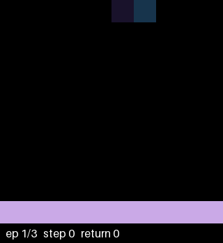

# deep-rl-from-scratch

Deep reinforcement learning algorithms — DQN, PPO, SAC — implemented from scratch in PyTorch and benchmarked apples-to-apples on a shared training harness. No RL libraries.

The project has two parts:

- **Spine:** DQN → PPO → SAC, each a standalone milestone with a headline metric against a published baseline. Vanilla DQN is discrete-only and SAC is continuous-only, so the suite runs on two tracks with PPO as the bridge:
  - **Discrete** (DQN vs PPO): CartPole / LunarLander for sanity checks, then MinAtar.
  - **Continuous** (PPO vs SAC): MuJoCo locomotion (HalfCheetah, Hopper, Walker2d).
- **Capstone:** the best-performing algorithm pointed at one substantial environment with published baselines. Environment TBD.

## Layout

```
configs/          # one YAML per run: env id, seed, algorithm hyperparameters
rl/
├── agents/       # Agent interface + implementations (random, tabular Q; DQN/PPO/SAC later)
├── networks/     # MLP/CNN encoders (later phases)
├── buffers/      # replay (off-policy) and rollout (on-policy) buffers
├── envs/         # Gymnasium env factory + wrappers; vectorization seam
├── common/       # seeding, config, logger, evaluation, checkpointing
└── train.py      # unified entry point: config -> env + agent -> train/eval loop
scripts/          # run helpers
tests/            # harness sanity tests (must always stay green)
runs/             # run outputs: checkpoints, TensorBoard events (gitignored)
```

Every algorithm plugs into the same entry point, logger, and evaluation protocol:

```
python -m rl.train --config configs/<run>.yaml
```

## Design rules

- **From scratch.** No Stable-Baselines3, RLlib, Tianshou, or CleanRL as dependencies — owning the algorithm implementations is the point.
- **One harness.** Shared seeding, logging, evaluation, and checkpointing, with locked metric names (`rollout/episode_return`, `eval/return_mean`, …) so learning curves compare directly across algorithms.
- **Both action spaces are first-class.** Nothing in shared code assumes discrete actions.
- **Reproducible evaluation:** fixed eval seeds, deterministic policy, N episodes, mean ± std.
- **Minimal dependencies**, pinned. CPU by default; GPU only enters at the capstone.

## Status

| Phase | Deliverable | Status |
|------:|-------------|--------|
| 0 | Repo + shared harness; random-policy pipeline check on CartPole; tabular Q-learning on FrozenLake | done — Q-learning hits 0.67 success on slippery FrozenLake (random: 0.02, optimal: ~0.74) |
| 1 | DQN (replay buffer, target network, ε-greedy; Double/Dueling/n-step as toggles) | done — reproduces the MinAtar paper's DQN on all 5 games (see Results); solves CartPole/LunarLander at peak |
| 2 | PPO (GAE, clipped objective, entropy bonus, vectorized rollouts) | planned |
| 3 | SAC (twin critics, reparameterized actor, auto-tuned entropy temperature) | planned |
| 4 | Capstone vs published baseline | planned — env TBD |

## Results — Phase 1: DQN on MinAtar


From-scratch DQN reproduces the MinAtar paper's published DQN results (Young & Tian 2019; 5M frames, `-v0` envs — full 6-action set, sticky actions p=0.1) on **all five games**, 3 seeds per setting (paper: 30). Numbers are training return averaged over the final 500k steps, mean ± std across seeds — the paper's own ε-contaminated metric:

| Game | Best-matching setting | Ours | Paper ≈ |
|---|---|---|---|
| Breakout | Adam 2.5e-4 | 10.3 ± 0.4 | 10 |
| Freeway | either optimizer | 51.1 ± 0.1 (Adam) / 53.4 ± 0.2 (RMSprop) | 50.5 |
| Seaquest | centered RMSprop 2.5e-4 | 19.7 ± 4.1 | 20 |
| Space Invaders | centered RMSprop 2.5e-4 | 44.7 ± 0.5 | 45 |
| Asterix | centered RMSprop 1e-4 | 16.8 ± 1.2 | 16.5 |

Findings worth the compute:

- **Optimizer choice interacts per-game.** Adam matches or beats the paper's centered RMSprop on Breakout and Freeway, but loses badly on Seaquest (5.4 vs 19.7) and Space Invaders (32.3 vs 44.7) at the same learning rate. The published curves are RMSprop curves: replicating them took the paper's optimizer on three games and its per-game step-size tuning on Asterix.
- **Greedy policies score far above training return** — the ε=0.1 exploration floor is expensive here (Space Invaders: greedy ~91 vs ε-contaminated 45; one random action drops the ball / walks into a bullet).
- **Breakout ablations** (3 seeds each, de-biased 100-episode evals): n-step 3 yields the best final policy (25.1 vs vanilla's 23.3); Double DQN eliminates the best-vs-final churn gap (−0.1 vs vanilla's +2.5) at a training-return cost — textbook overestimation damping at the textbook price.
- **Training-time "best eval" checkpoints are winner's-cursed:** a 20-episode best overstates a fresh 100-episode re-eval by ~15% on every variant. Headline numbers use the de-biased protocol (`scripts/eval_checkpoint.py`, disjoint eval seeds).
- A strong Seaquest policy can survive **indefinitely** under greedy eval (oxygen is renewable and MinAtar registers no time limit) — two diagnostic runs spent 5+ hours inside a single eval episode before the eval protocol gained a 10k-step cap.

What that looks like in play — greedy rollouts from the best Seaquest checkpoint (centered RMSprop, seed 0), recorded with `scripts/record.py`:



Three sample episodes scoring 32 / 73 / 36 (greedy play runs well above the ε-contaminated table metric). The 961-step middle episode is the oxygen loop working: shoot fish, pick up divers, surface to trade a diver for a full oxygen bar before it empties — the same loop that, done too well, makes a policy immortal.

Full experiment log in `PLAN.md`. Every run directory is self-describing — resolved config, git SHA, package versions, W&B history, best + final checkpoints — across the 63 five-million-step runs (~60 core-hours on a laptop CPU) behind these numbers.

## Setup

Requires Python ≥ 3.10. The `box2d` extra (LunarLander) needs `swig` available at install time (`brew install swig` on macOS).

```
python -m venv .venv && source .venv/bin/activate
pip install -e ".[dev]"
```

## Run

Train (W&B is the default logger — `wandb login` first, or prefix with
`WANDB_MODE=offline`, or set `logger: tensorboard` in the YAML):

```
python -m rl.train --config configs/frozenlake_q.yaml     # Q-learning on FrozenLake
python -m rl.train --config configs/cartpole_random.yaml  # random-policy pipeline check
```

Training is single-threaded torch by default (`torch_threads: 1` in the
config): per-step RL kernels are microseconds of math, so the default
intra-op thread pool costs more in fork/join than it buys (5x+ measured
slowdown on MinAtar), and one core per run is what lets multi-seed
benchmarks parallelize. For benchmark runs, also set the env var — the
OpenMP runtime sizes its pool at import time, before the config can act:

```
OMP_NUM_THREADS=1 python -m rl.train --config configs/minatar_breakout_dqn.yaml
```

Watch a trained checkpoint play in a render window, with a live step/return
line per episode (`--episodes N`; `--fps N` for slow motion — CartPole's
native 50 fps is over in a blink):

```
python scripts/watch.py runs/frozenlake_q/checkpoint.pt
python scripts/watch.py runs/cartpole_random/checkpoint.pt --fps 15   # random policy flailing
```

Record the same greedy rollouts as an annotated GIF — episode/step/return
stamped on every frame (`--seed` pins the episodes for a reproducible clip;
`--max-steps` caps recording of effectively-immortal policies):

```
python scripts/record.py runs/<run>/best_checkpoint.pt
```

Run outputs live under `runs/<run_name>/` (gitignored), so train before watching.
